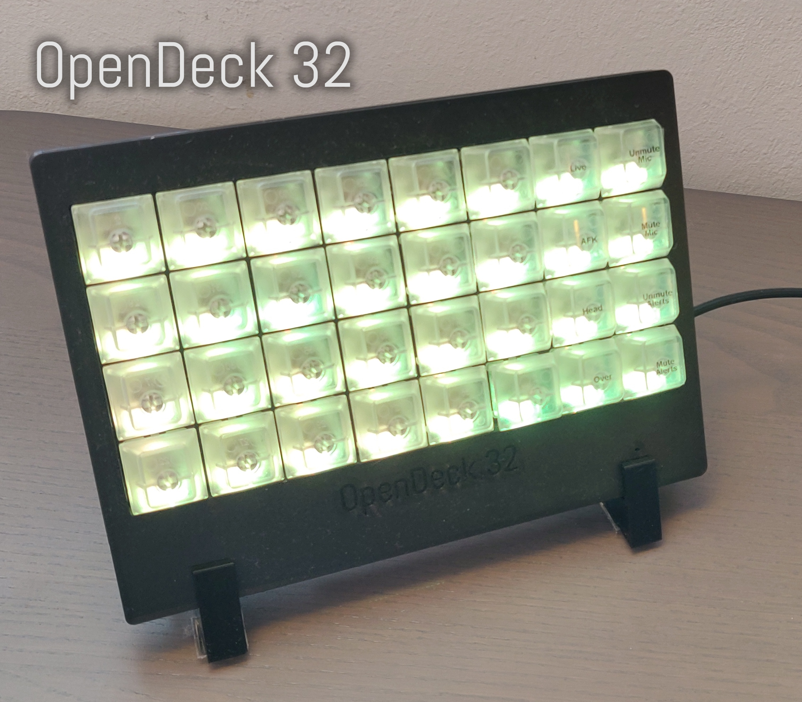

# OpenDeck
An open hardware/source 32-key (4x8) macro keypad based on QMK firmware.

# What it looks like?

# BOM
- **READ THE FULL INSTRUCTIONS BEFORE ORDERING PARTS OR BEGINNING ASSEMBLY**
- 1x PCB including all components from the BOM in the `hardware` folder. It's a good idea to get some spares as it's easy to mess up the assembly.
- 32x Cherry MX RGB compatible switches (e.g. MX1A-G1NA)
- 32x Keycaps of your choice (can be 3D printed)
- 1x 3D printed case body (see `mechanical/OpenDeck32` folder)
- 1x 3D printed switch plate (see `mechanical/OpenDeck32` folder)
- 1x 3D printed front plate (see `mechanical/OpenDeck32` folder)
- 1x 3D printed stand (see `mechanical/OpenDeck32` folder)
- 4x M3x0.5 15mm flathead (countersunk) screws
- 1x USB micro-B cable

For assembly an AVR ISP (Incircuit Serial Programmer) is needed unless the DFU bootloader is already programmed and correct fuses are set on your ATmega32U4 (unlikely). If you don't have an AVR ISP, you can a make a make shift programmer from it but pay close attention to the wiring, you can destroy the OpenDeck PCB and/or your Arduino if you wire it wrong.

# Electrical Assembly
**CAUTION:** The following assembly steps require soldering of Surface Mount Devices (SMDs). If you're unfamiliar with SMD soldering I recommend viewing some tutorials on the topic and maybe purchasing a practice kit online. **DO NOT ATTEMPT ASSEMBLY IF YOU'RE NOT CONFIDENT WITH SMD SOLDERING, YOU ARE VERY LIKELY TO BREAK THE COMPONENTS**.

**CAUTION 2:** When hand soldering TQFP and SSOP chips (the two large ICs on the PCB) it is very easy to bridge the pins with solder (or flux, if you don't use a NO-CLEAN variety) and create a short circuit. This short circuit will most likely cause malfunction and could damage the chip, board or the device it's connected to, please carefully inspect and test each assembled board before powering it on. Flux should be used to make soldering easier of these components and to produce better solder joints. However note that some fluxes are electrically conductive and chemically corrosive and must be thoroughly washed off the board using isopropyl alcohol, carefull scrubbing with a toothbrush and wiping off with a tissue or disposable cloth.

## Tools needed:

- Soldering Iron with sponge or brass wool for cleaning the tip
- Thin soldering wire (much harder with thick solder but doable)
- ESD and heat safe tweezers, I recommend getting a pair of titanium tweezers
- Flux
- Isopropyl Alcohol
- Magnifying glass or microscope
- Multimeter
- AVR ISP (you can make one out of an [Arduino board and some jumper wires](https://www.arduino.cc/en/Tutorial/ArduinoISP) if you don't have one)
- Steady hands and lots of patience

## (Partial) PCB Assembly
**Note**: The crystal and two adjacent load capacitances are not strictly needed. The board will function just fine from the onboard RC oscillator of the ATmega32U4, the footprints are provided as an alternative clock source should the internal RC oscillator not be good enough.

**CAUTION**: Use an anti-static wrist band when assembling, ESD can damage the components during handling.

1. Read the full instructions before proceeding
1. Solder the ICs (ATmega32U4, IS31FL3731, USBLC6, SI2323DS) on the front side of the PCB
1. Solder the Surface Mount Device (SMD) caps, resistors, fuses and the power LED on the front of PCB, pay close attention to the orientation of any LEDs and Diodes. **DO NOT SOLDER** the RGB LEDs or the diodes of the keymatrix yet, we will verify that the assembly of the hard parts is correct befor soldering these components.
1. Good job, take a break, grab a coffee.
1. Solder the through hole components **EXCEPT** the key switches, they need to be mounted to the switch plate before soldering and the board must pass electrical testing before we solder them.
1. Solder the back side SMD components. 
1. Everything except the RGB LEDs, Switches and Diodes of the keymatrix should now be soldered.
1. Clean up the board with generous amounts of isopropyl alcohol, gentle scrubbing with a toothbrush (try to reach in between the IC legs with the bristles) and wiping off the excess with clean tissues. You can check if you have gotten all the flux residue off the board by adding more isopropyl alcohol and and scrubbing carefully but thoroughly with the toothbrush, if the isopropyl alcohol evaporates without leaving a visible stain on the PCB, it is clean (the stain is flux residue).

## Electrical Verification (Part 1)

1. Optically inspect all the pins of the ATmega32U4, IS31FL3731 and USBLC6 for solder bridges. The bridges can appear between the pad, or the legs of the IC. They can be hard to see, use good lighting and a magnifying glass or microscope to inspect.
1. Using a multimeter in resistance mode at the 100k Ohm range, put the common ground probe of the multimeter onto the ground pin on the 6 pin header and the positive probe onto VCC on the 6 pin header, you should read somewhere around 30k-60k ohm resistance initially.
   - If you read significantly lower resistance, check the board for flux residue and/or solder bridges.
   - If you read significantly higher resistance, check the board for bad solder joints and connections and if you damaged any traces during assembly.
1. Do the same thing for the power and ground pin on the USB header.
1. Turn the multimeter to continuity testing mode. Place the common ground probe on the right leg (towards the ATmega32U4) of the LED next to the ATmega32U4 and the positive probe on the other leg. The LED should light up ever so slightly if it has the correct orientation.
   - If the LED doesn't light up, test on another (not soldered) LED, if it lights up in either orientation then the one on the PCB is oriented the wrong way, desolder and reorient it properly.
1. Verify that D65 is oriented with the line on the diode facing towards the right (IMPORTANT!)
1. The board is safe to power on. 

## Firmware install

**NOTE: You're going to plug in a home made device into your potentially expensive PC, we have taken all reasonable precautions and the USB spec is fairly resilient to misbehaving devices but there is still a small risk of damage to your PC. Proceed at your own risk, you have been warned.**

**NOTE: In case there was an assembly error which we did not detect with the prior testing, the USB host controller on the connected PC may enter a fault protection mode where it shuts down the entire controller (or parts of it) this will cause devices connected to it (mice, keyboards etc) to stop working. Don't be alarmed, the controller should reset after a hard power cycle of the PC.**

1. We need to program the fuses on the chip properly, using [`avrdude`](https://www.nongnu.org/avrdude/). The fuse bits that should be burned can be passed to `avrdude` as `-U lfuse:w:0x62:m -U hfuse:w:0xd9:m -U efuse:w:0xf3:m` after having selected your ISP type, baud rate, port and the correct MCU type with `-p m32u4`.
   - TBD: Add example invocation for AVR ISP under linux
1. Download the [Atmel DFU bootloader for mega chips](http://ww1.microchip.com/downloads/en/DeviceDoc/megaUSB_DFU_Bootloaders.zip) onto your hard drive and exctract the bootloader for the ATmega32U4.
1. Using `avrdude` flash the bootloader onto the ATmega32U4. 
1. Clone https://github.com/EmilyBjoerk/qmk_firmware and `cd` into the directory.
1. [Install QMK toolbox](https://beta.docs.qmk.fm/cli/cli), we only need the DFU programmer, you can ignore warings about other programmers not being found.
   - Select the cloned repo as your `QMK_HOME`.
1. [Configure QMK toolbox](https://beta.docs.qmk.fm/cli/cli_configuration), select keyboard `opendeck/32/rev1` and keymap `default`.
1. [Compile and Flash](https://beta.docs.qmk.fm/cli/cli_commands) the built firmware onte the ATmega32U4 using the DFU (USB) bootloader/programmer.

## Electrical Verification (Part 2)

Now that the board has a firmware on it we can check that the pins driving the key matrix are not shorted.

1. Connect the PCB using USB to your PCB
1. Load up a keylogger that supports the F13 to F24 keys.
1. Using a jumper wire, we're going to short some pads on the PCB to simulate key presses. 
   - For every swich there is a left and a right through hole pad (the right slightly higher up on the PCB) and a SMD diode with two pads above it.
   - For every switch, short the right upper through hole pad to the right upper leg of the corresponding SMD diode pad, your keylogger should record a keypress as F13-F24 possibly with some modifier (shift/control).
   - Repeat for each switch to see that they are all working.
   - Pay attention to spurious key-presses or unreliable behaviour, both can indicate short circuits that need to be resolved by reflowing joints to remove bridges or by cleaning out flux residue.
 1. If all the keys work proceed to the next stage.

## (partial) PCB assembly and verification Part 2

1. Solder all the remaining SMD components. Each of the diodes and RGB diodes have an orientation that must be respected when assembling.
   - To verify that the RGB diode is correctly oriented, take your multimeter in continuity testing mode, place the positive lead on the bottom left pin of the RGB LED and the common ground lead on any other pin, you should see one of the LEDs light up slightly, if not, rotate the LED.
   - Note that the colours of the LED may not be what you expect due to the low burden voltage of the multimeter. In particular the blue may appear red. Don't worry about this for now, we only need to worry about them lighting up at all which shows us the correct orientation.
   - The diodes should have a line marking on them, this line must face the marking on the PCB (to the right).
   - The RGB diodes' legs are small and close together, they are very easy to shord, please be careful and pay close attention to the solder.
1. Follow the procedure from above to clean up any flux residue from the board.
1. Optically inspect the solder joints for shorts and bridges.
1. Plug into PC, you should now see RCB puke on the key matrix.
1. Validate that all three LEDs are working on all switches.
1. Using the same jumper and keylogger from before, short the switch legs (left and right pad of the swich now, instead of the diode) to test that each diode is oriented correctly. Doing repairs after we have soldered the switches will be extremely hard due to the switch plate not allowing access without desoldering ALL switches. **PLEASE DO NOT SKIP THIS VERIFICATION STEP**.

# Final Assembly
0. Clip all switches to the switch plate, mind the orientation of the plate and the switches with respect to the PCB
0. Attach the PCB and the switchplate with the switches, make sure that the 6 pin header next to the reset push button on the PCB is inside of the opening on the bottom of the switch plate
0. Once certain that everything is correctly attached, solder the switches from the back of the PCB
0. Place the PCB and switch plate assembly in the case body, pay close attention to the USB connector's opening
0. Add the front plate on top, pay attention to orientation and screw together the assembly from the bottom using the M3x0.5 15mm screws, note that the screws are self tapping and you will encounter some resistance. Do not screw in too fast to avoid deforming the threads.
   - Note that the front cover, switch plate and case will "sandwitch" the PCB to hold it in place and the two bottom screws will go through the mounting holes in the PCB.
0. Attach keycaps
0. Plug in.
0. Place on stand and enjoy.

# Use
The keys are programmed to send F13-F24 with various combinations of modifiers (shift + control) by default. You can modify the firmware to send different key combinations or whatever you'd please by changing the source code in `keyboards/opendeck/32/` to your liking. Instructions for that can be found in the QMK documentation. You can also set specific RGB colour per key etc.

The device will appear as a regular USB keyboard to your computer.
